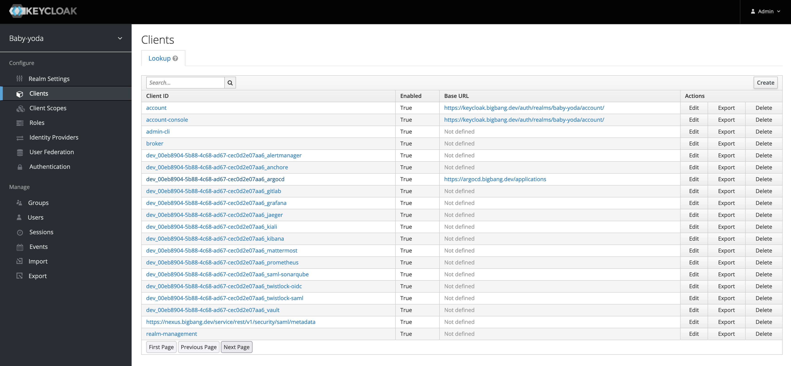
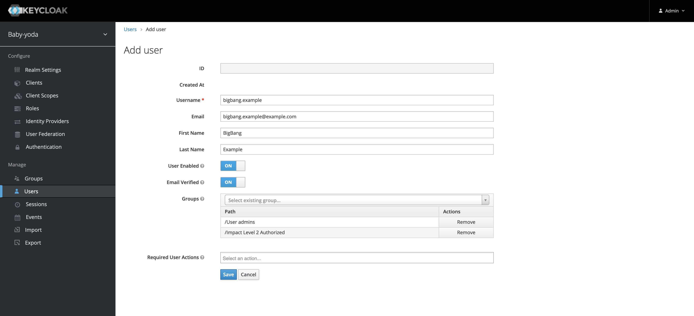
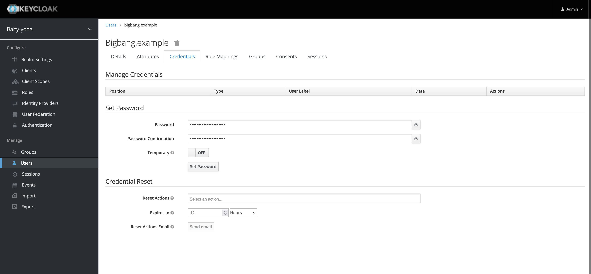
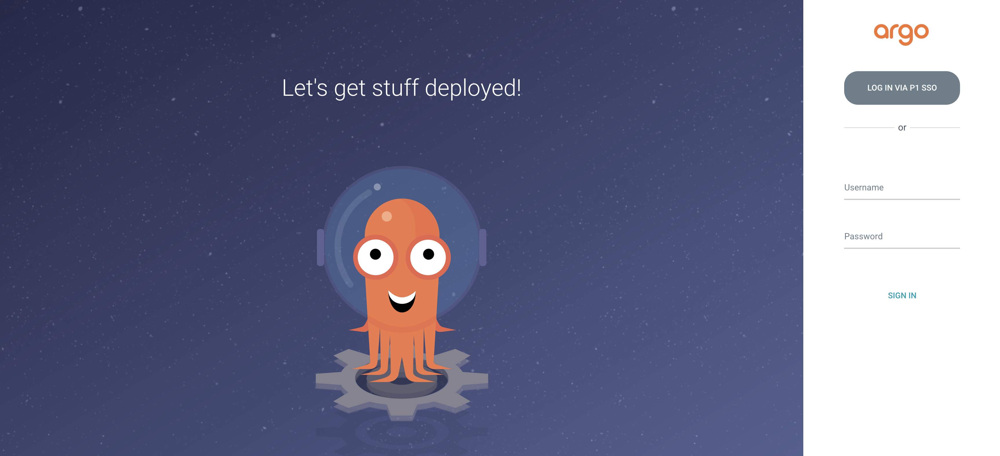

# Configure ArgoCD SSO Login With Keycloak

***Note:*** This configuration should be used for development only, and not used in production environments. This guide shows an example values configuration and describes necessary steps to verify SSO login for ArgoCD in Big Bang after an upgrade.

This guide assumes you are deploying Big Bang with ArgoCD enabled as an addon package.

## Example Big Bang Overlay Values

The example overlay values configuration will deploy Big Bang with only Istio, Keycloak, and ArgoCD.

Notes about the values:

- The public-ingressgateway is used by default with Istio for most applications in Big Bang, except for Keycloak and Vault. They allow TLS to passthrough the gateway, rather than TLS be terminated at the gateway.

- This means we will use a different Istio gateway for SSO with Keycloak; the passthrough-gateway.

```yaml
istio:
  enabled: true
  # Passthrough gateway must be used for keycloak and vault
  ingressGateways:
    passthrough-ingressgateway:
      type: "LoadBalancer"
  gateways:
    passthrough:
      ingressGateway: "passthrough-ingressgateway"
      hosts:
      - "*.{{ .Values.domain }}"
      tls:
        mode: "PASSTHROUGH"

sso:
  oidc:
    host: keycloak.bigbang.dev
    realm: baby-yoda

istiooperator:
  enabled: true

jaeger:
  enabled: false

kiali:
  enabled: false

clusterAuditor:
  enabled: false

gatekeeper:
  enabled: false

kyverno:
  enabled: false

kyvernopolicies:
  enabled: false

kyvernoreporter:
  enabled: false

logging:
  enabled: false

eckoperator:
  enabled: false

fluentbit:
  enabled: false

promtail:
  enabled: false

loki:
  enabled: false

tempo:
  enabled: false

monitoring:
  enabled: false

twistlock:
  enabled: false

addons:
  argocd:
    enabled: true
    git:
      branch: renovate/ironbank # this is the name of the branch that you're making changes on in the argocd package repository
    sso:
      # -- Toggle SSO for ArgoCD on and off
      enabled: true
      client_id: dev_00eb8904-5b88-4c68-ad67-cec0d2e07aa6_argocd
      client_secret: anything-for-dev
      provider_name: "P1 SSO"
      groups: |
        g, Impact Level 2 Authorized, role:admin
    values:
      sso:
        rbac:
          policy.default: role:admin
      configs:
        cm:
          url: https://argocd.bigbang.dev

  keycloak:
    enabled: true
    values:
      secrets:
        env:
          stringData:
            CUSTOM_REGISTRATION_CONFIG: /opt/jboss/keycloak/customreg.yaml
            KEYCLOAK_IMPORT: /opt/jboss/keycloak/realm.json
        customreg:
          stringData:
            customreg.yaml: '{{ .Files.Get "resources/dev/baby-yoda.yaml" }}'
        realm:
          stringData:
            realm.json: '{{ .Files.Get "resources/dev/baby-yoda.json" }}'
      extraVolumes: |-
        - name: certauthority
          secret:
            secretName: {{ include "keycloak.fullname" . }}-certauthority
        - name: customreg
          secret:
            secretName: {{ include "keycloak.fullname" . }}-customreg
        - name: realm
          secret:
            secretName: {{ include "keycloak.fullname" . }}-realm
      extraVolumeMounts: |-
        - name: customreg
          mountPath: /opt/jboss/keycloak/customreg.yaml
          subPath: customreg.yaml
          readOnly: true
        - name: realm
          mountPath: /opt/jboss/keycloak/realm.json
          subPath: realm.json
          readOnly: true
```

## Deploy Big Bang

Be sure to point to your overlay values file containing the configuration above. You will also want to point to the [TLS certs](https://repo1.dso.mil/platform-one/big-bang/bigbang/-/blob/master/chart/ingress-certs.yaml) used by Istio and Keycloak.

The example below can be used to deploy Big Bang with the necessary configuration for local development and testing for SSO login with Keycloak

There are a few notable assumptions made in the example:

- You have a Kubernetes cluster running that is accessible
- Flux has been installed
- Using `helm` cli to deploy Big Bang
- At the root of the [Big Bang repository](https://repo1.dso.mil/platform-one/big-bang/bigbang.git) on the `master` branch
- The location of your overlay values file for Big Bang is at `~/.bigbang-dev-values.yaml`
- The location of your registry1 credentials values are at `~/.registry1-creds.yaml`

```bash
helm upgrade --install bigbang chart/ \
      --values chart/ingress-certs.yaml \
      --values ~/.bigbang-dev-values.yaml \
      --values ~/.registry1-creds.yaml \
      --create-namespace \
      --namespace bigbang 
```

## Configure Keycloak

- Once Big Bang is deployed and all of the helm releases have reconciled and all pods are up and running, you'll want to visit <https://keycloak.bigbang.dev/auth/admin> to login to the Keycloak admin console

- The admin credentials are:
  - username: admin
  - password: password

### Change the ArgoCD client base URL

- Change the argocd client base URL to <https://argocd.bigbang.dev/applications>



### Create a user in Keycloak

- Along the left-hand side of the screen, under the `Manage` column, select `Users`

- Select `Add user`

- You can use this configuration as an example
  
  

- Save the new user

- Create a new password for the new user



- Select `Set Password`

## Login to ArgoCD with Keycloak (P1) SSO

- Navigate to <https://argocd.bigbang.dev>

- Login to ArgoCD via the `Log in via P1 SSO` button

- 

- Enter credentials

- Setup MFA and enter code

- You should be redirected to the ArgoCD homepage
